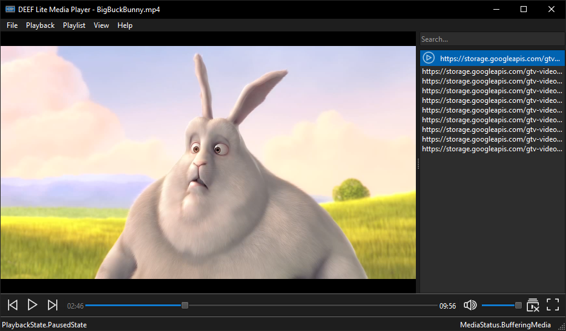

# DEEF Lite Media Player
Crosst-platform media player that tries to stick to the principles: **fast**, **light**, **open**.

  

## Screenshots


## Quick Start
### Source Code
1. **Clone the Repository**  
   Clone the project repository to your local machine:
   ```bash
   git clone https://github.com/deeffest/DEEF-Lite-Media-Player.git
   ```
2. **Navigate to the Project Directory**  
   Enter the project folder:
   ```bash
   cd DEEF-Lite-Media-Player
   ```
3. **Install Dependencies**  
   Install the required dependencies:
   ```bash
   pip install -r requirements.txt
   ```
4. **Run the Application**  
   Start the DLMPlayer:
   ```bash
   python DLMPlayer.py
   ```

### Ready-to-Use Builds
1. **Download the Latest Release**  
   Get the latest version for your OS from the [Releases page](https://github.com/deeffest/DEEF-Lite-Media-Player/releases/latest).

2. **Extract the Archive**  
   Unzip the downloaded archive to a location of your choice.

3. **Run the Application**  
   Open the extracted folder, then run the executable file to start the DLMPlayer.

## See also
- [deeffest/DEEF-Lite-Image-Viewer](https://github.com/deeffest/DEEF-Lite-Image-Viewer): Сross-platform image viewer.

## License
The DEEF Lite Media Player is distributed under the **GPLv3 license**.

**We’d love to hear your questions or suggestions!** 💬
